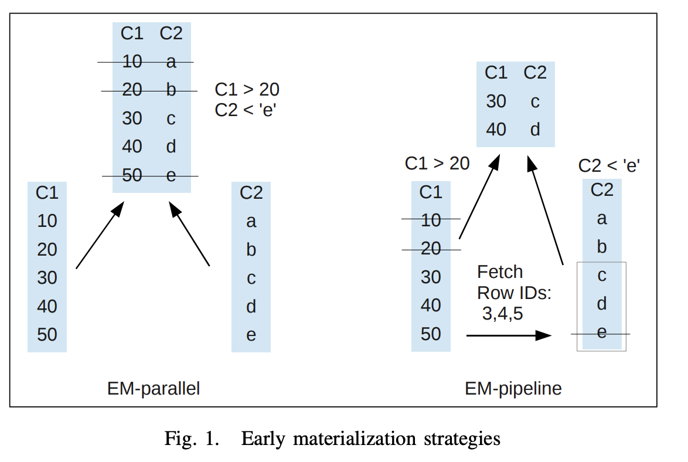

## Introduction and Motivation
Early materialization refers to the technique of stitching columns into partial tuples as early as possible, i.e., during column scan in query processing.

提前物化有两种模式，EM-parallel & EM-pipeline.
For early materialized query plans, Vertica uses the EM-pipeline strategy exclusively, since we have found that it works well in practice.

Late materialization refers to the technique of fetching columns on demand for each operator in the query plan. 比如，对于一个涉及到多个 join 的查询，只有与那个 join 条件有关的列会参与 join 判断计算，join 计算的结果 is only **the set of matching row ids**, 这个结果被用于 fetch 其他列中有用的行。由于每个 join 都会包含两张表，那么对于两者表，理论上各自都可以用 early materialization or late materialization，然而实际上，根据经验，在 Veritca 中仅对 join 操作中的一个输入进行延迟物化是有意义的。在 Vertica 中，join 的延迟物化只会对 join 操作的 outer table 应用，即用来进行 probe 的表，而对于 inner table，总是进行提前物化。

以 Fig. 2 左边的延迟物化为例，`Join C1 = D1` 的输入是 C 的 join 列 C1，以及 D 的 所有列，使用 D 表构建 hash 表之后，使用 C1 做 probe，得到 C 的 row id set，然后用这个 row id set 去 scan C2 列，然后再进行 Combine 操作。

**假如我们希望对 D 也使用延迟物化？效果并不好。因为 D 表是用来构建 hash 表的输入，在 probe 过程中，如果要输出 D 表满足 join 的 row id set，那么得到的结果天然是乱序的，如果用乱序的 row id 去 fetch，那么多次随机读效率很低，如果要等到 row id 全部产生后再 fetch D2，那么 Join 的输出就不是流式的，而是类似批处理的方式，所以对 D 表（inner table/hash build inpout）进行延迟物化是没有意义的。**

对于 large table，这种 join 的延迟物化技术的最大收益在于减少 probe 表的 disk I/O，同时这种收益也是很复杂的，– tracking which columns to materialize at what point involves a lot of bookkeeping in the optimizer, and execution engine and has to be accounted for in the cost model during query optimization.